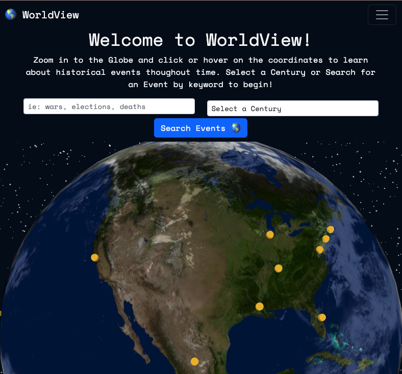
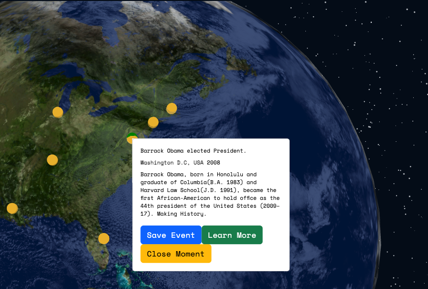

# WorldView 🗺

🌍 [Deployed App Link](https://my-world-view.herokuapp.com/) 🌎


## Table of Contents

- [Description](#description)
- [Usage](#usage)
- [Screenshots](#screenshots)
- [Technologies Used](#technologies-used)
- [Questions](#questions)
- [License](#license)

## Description

```
Our react-based globe shows top world events from three different centuries:
1800s, 1900s, and the 2000s.
You are able to explore the world’s events by simply rotating the globe to find the world’s area you are interested in.
When you hover over a location, you will obtain the summary of the event, the date and a link to learn more!
As a logged-in user, you are able to save events you are interested in coming back to in the future.

```

## Usage

Install dependencies:

```
npm i
```

```
npm run develop
```

**[⬆ back to top](#table-of-contents)**

## Screenshots

```
Search Navigation Bar:
```

<br>
 
<br>

```
Historical event in India example:
```

<br>
 
<br>

```
"Obama becomes president" example:
```

<br>
 
<br>

```
Saved Page example:
```

<br>
 
<br>

**[⬆ back to top](#table-of-contents)**

## Technologies Used

- [React](https://nodejs.org/en/)
- [Bootstrap](https://getbootstrap.com/docs/4.0/components/modal/)
- [MongoDB](https://www.mongodb.com/docs/manual/tutorial/install-mongodb-on-os-x/)
- [Apollo](https://studio.apollographql.com/)
- [Heroku](https://id.heroku.com/login)
- [Concurrently](https://www.npmjs.com/package/concurrently)

**[⬆ back to top](#table-of-contents)**

## Questions ?

✉️  Contact us :

Github: [Ana C. Flores](https://github.com/anacecyflores1)
<a href="mailto: anacecyflores1@gmail.com"></a><a href="https://www.linkedin.com/in/anacecyflores/"></a><a href="https://cecy-professional-portfolio.herokuapp.com/" target="_blank"></a>

Github:[Mason Benson](https://github.com/mbenson025)
<a href="mailto: mbenson025@gmail.com"></a><a href="https://www.linkedin.com/in/mason-benson-6591b5102/"></a><a href="https://mb-reactportfolio.herokuapp.com/" target="_blank"></a>

Github:[Cristian Vargas ](https://github.com/vcristian1)
<a href="mailto: cristian.v0223@gmail.com"></a><a href="https://www.linkedin.com/in/cristian-vargas-13686a1a3/"></a><a href="https://vcristian1.github.io/vcristian_portfolio_demo/" target="_blank"></a>

**[⬆ back to top](#table-of-contents)**

## License

Copyright (c) 2022 Ana Cecilia Flores, Mason Benson, Cristian Vargas

Licensed under the [MIT](LICENSE) license.

**[⬆ back to top](#table-of-contents)**
